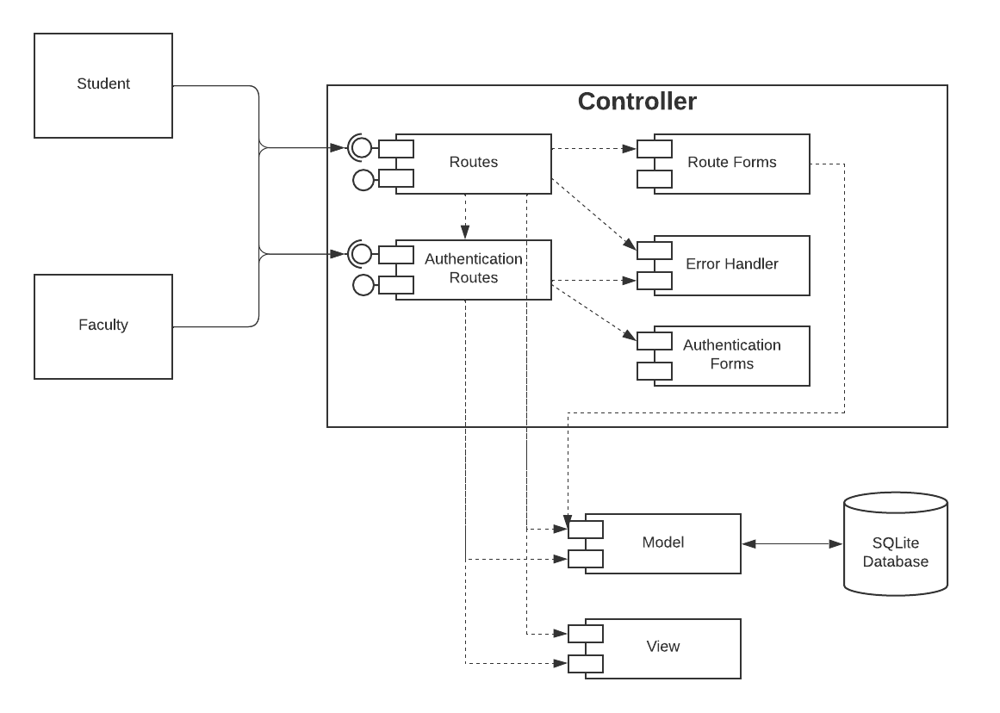
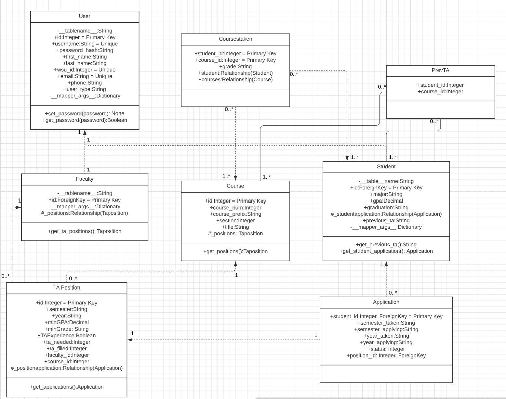

# Design Document

## TA Finder
--------
Prepared by:
* Cai Haught, Ella Blevins, Yeesa Kee
---

**Course** : CptS 322 - Software Engineering Principles I

**Instructor**: Sakire Arslan Ay

---

## Table of Contents
- [Design Document](#design-document)
  - [## TA Finder](#-ta-finder)
  - [* Cai Haught, Ella Blevins, Yeesa Kee](#-cai-haught-ella-blevins-yeesa-kee)
  - [Table of Contents](#table-of-contents)
    - [Document Revision History](#document-revision-history)
- [1. Introduction](#1-introduction)
- [2.	Architectural and Component-level Design](#2architectural-and-component-level-design)
  - [2.1 System Structure](#21-system-structure)
      - [Model:](#model)
      - [View:](#view)
      - [Controller:](#controller)
      - [Rationale:](#rationale)
  - [2.2 Subsystem Design](#22-subsystem-design)
    - [2.2.1 Model](#221-model)
    - [2.2.2 Controller](#222-controller)
    - [2.2.3 View and User Interface Design](#223-view-and-user-interface-design)
- [3. Progress Report](#3-progress-report)
- [4. Testing Plan](#4-testing-plan)
- [5. References](#5-references)
  - [N/A](#na)

### Document Revision History

| Name | Date | Changes | Version |
| ------ | ------ | --------- | --------- |
|Revision 1 |2021-10-22 |Initial draft | 1.0        |
|Revision 2 |2022-11-14 |Second draft  | 2.0        |
|      |      |         |         |

# 1. Introduction

This document includes the design specifications and implementation details for the MVC TA Finder application.
The TA Finder applications helps faculty to find and create TA Positions for their courses. Students can apply to open TA positions. It allows faculty to go through all the applicants and choose their TAs.

[Section II](#2-architectural-and-component-level-design) includes the architectural and component level design specifications for the TA Finder application.

[Section III](#22-subsystem-design) includes the subsystems and their design specifications for the TA Finder application

# 2.	Architectural and Component-level Design
## 2.1 System Structure

This section should describe the high-level architecture of your software:  i.e., the major subsystems and how they fit together. 
If you adopted the application structure we used in the Smile App, your application would have the Model-View-Controller (MVC) pattern. If you adopted a different architectural pattern, mention the pattern you adopted in your software and briefly discuss the rationale for using the proposed architecture (i.e., why that pattern fits well for your system).

<kbd></kbd>

#### Model:
Model represents objects in the system (Students, Faculty, Applications, and TA Positions). These models are then stored in our SQLite Database. 

#### View:
View allows the user to see and interact with the data stored in the database in a user friendly way. It allows them access to the functionalities of the system.

#### Controller:
Controller sends and validates data between Model and View.

#### Rationale:
By dividing the system into Model, View, and Controller, it allows for low coupling so that any changes made to any one system has low impact toward the other systems. It also allows for high coherence by grouping related subsystems together to prevent redundancy. By splitting the authorization routes and forms allows for reuse of the log in function independent of the User type.

## 2.2 Subsystem Design 

### 2.2.1 Model

Model represents the different objects such as Users or Fields that interact with the system.

* User: Represents a person (student or faculty), stores all the basic information that both a student and faculty are required to input.
  | Attributes              | Description  |
  | ------------------ |----|
  |id| Each User has a unique id|
  |username| the user's email|
  |password_hash| user's password|
  |first_name| user's first name|
  |last_name| user's last nameing|
  |wsu_id| user's WSU id|
  |email| user's email|
  |phone| user's phone number|
  |user_type| Student or Faculty|

* Student: Represents a student, stores all the information a student is required to input.
  | Attributes              | Description  |
  | ------------------ |--|
  |id| student's User id|
  |major| student's major|
  |gpa| student's gpa |
  |graduation| student's expected graduation date|
  |_studentapplication| student's applications for TA positions|
  |previous_ta| student's previously TA's classes|

* Faculty: Represents a faculty member, stores all the information a faculty member is required to input.
  | Attributes              | Description  |
  | ------------------ |--|
  |id| Faculty's User id|
  |_positions| The TA positions a faculty member has created|

* Taposition: Represents a course that a faculty member created. Stores 
  | Attributes              | Description  |
  | ------------------ |--|
  |id| Unique id for each TA position|
  |semester| The semester the position is for|
  |year| The year the position is for|
  |minGPA| The minimum GPA required for the TA position|
  |minGrade| The minimum grade earned for the TA position|
  |TAExperience| Whether or not the student has had prior TA experience|
  |ta_needed| How many TAs are needed for the course|
  |ta_filled| How many TA positions have been filled for the course|
  |course_id| The course for a given TA position|
  |_positionapplication| Contains the collections of applications for a TA position|

* Application: Represents a single TA application from a Student.
  | Attributes              | Description  |
  | ------------------ |--|
  |student_id| Student's id|
  |semester_taken| The semester the Student took the course|
  |semester_applying| The semester the Student is applying for|
  |status| The status of an application  |
  |position_id| The TA position which the application is for|

* Course: Represents the course for a given TA position.
  | Attributes              | Description  |
  | ------------------ |--|
  |id| Unique id for each course|
  |course_num| The course number for the course of the TA position|
  |course_prefix| The course prefix for the course of the TA position|
  |title| The name of the course for the TA position|
  |_positions| The collection of TA positions for a course|

* Coursestaken: Represents the courses a student has previously taken.
  | Attributes              | Description  |
  | ------------------ |--|
  |student_id| Primary key with course_id which refers to the id of the student who has taken a course |
  |course_id|Primary key with student_id which refers to the id of the course which a student has previously taken|
  |grade_earned| The grade earned for a student in a given course|
  |student| The reference to the list Students |
  |courses| The reference to the list of Courses|

* Prevta: Represents the previous courses a student has TA'd for
  | Attributes              | Description  |
  | ------------------ |--|
  |student_id| Id of the student |
  |course_id|Id of the course|

<kbd></kbd>

### 2.2.2 Controller

Controller allows the user to interact with the system through routes.

Subsystems:
* Authorization Forms: 
  * Create Form Objects (Student or Faculty) that are used to verify and store all the fields given by the user to create a correspoding account. 
  * Create Form Object used to verify and store data given by the user to log into an account.
* Authorization Routes: Allow users to interact with the system to create or log into an account. 
  * Creating an account: Creates an Authorization Form (Student or Faculty) for the user to fill out, validates the data, then creates an account with the given information.
  * Logging into an account: Creates an Login Authorization Form, validates the data, then log the user into the account.

  |   | Methods           | URL Path   | Description  |
  |:--|:------------------|:-----------|:-------------|
  |1. |GET, POST|/register_student|If the user is already logged into an account, route to the main page for that account type (Student or Faculty).   Otherwise, route to the Student registration page. If all data given by the user is verified, create a Student account.|
  |2. |GET, POST|register_faculty|If the user is already logged into an account, route to the main page for that account type (Student or Faculty).   Otherwise, route to the Faculty registration page. If all data given by the user is verified, create a Faculty account.|
  |3. |GET, POST|login|If the user is already logged into an account, route to the main page for that account type (Student or Faculty).   Otherwise, if data given by the user is verified, log into their account.|
  |4. |GET|logout|Loggout the current user and return them to the login page.|
  

* Routes: Allow users to navigate to different web pages depending on the type of account they are logged in as (Student or Faculty).
  
  |   | Methods           | URL Path   | Description  |
  |:--|:------------------|:-----------|:-------------|
  |1. |GET|/   /index_student|Verifies that user is logged into a Student account, then routes the user to the main page for a Student account.|
  |2. |GET|/   /index_faculty|Verifies that user is logged into a Faculty account, then routes the user to the main page for a Faculty account.|
  |3. |GET, POST|create_taposition|User logged in as a Faculty can create a ta position for a course.|
  |4. |GET, POST|create_application|User logged in as a Student can create an application for an open TA position.|
  |5. |GET, POST|withdraw_application|User logged in as a Student can withdraw an application that they submitted and are still under review.|
  |6. |GET, POST|approve_application|User logged in as a Faculty who created the ta position can approve a student's ta application.|
  |7. |GET, POST|close_application|User logged in as a Faculty can close a ta position they created. (Students can then no loger apply to the position.)|
  |8. |GET|check_application_status|User logged in as a Student can check the status of all the applications that they have submitted.|
  |9. |GET|view_applicants|User logged in as a Faculty can view all the ta applications submitted for the ta positions they have created.|
  |10. |GET|view_qualifications|User logged in as a Faculty can view the qualifications of the Student that submitted an application for a ta position the Faculty created.|

### 2.2.3 View and User Interface Design  

Accesses the Model's data and display it to the user. Also, provides easy usage of the application. Currently, no frameworks or libraries are in use but at a later time we may decide to implement a framework/library such as Bootstrap to enhance the webpage. 

| Template              | Description  |
  | ------------------ |--|
  |base.html| The base layout for the application in which all other pages will inherit|
  |index_faculty.html| A Faculty user's main page where they can view all TA positions they have created (uses faculty_taposition.html)|
  |index_student.html| A Student user's main page where they can view all open TA positions. Recommended positions appear at the top (uses student_taposition.html)|
  |login.html| Displays the login page|
  |register_faculty.html| Contains the registration page for faculty users|
  |register_student.html| Contains the registration page for student users|
  |create_taposition.html| Faculty users can create TA positions from this page|
  |faculty_taposition.html| Contains TA position information to be displayed on the faculty main page (used in index_faculty.html)|
  |student_taposition.html| Contains TA position information to be displayed on the student main page (used in index_student.html)|
  |application_status.html| Student users can view their open applications statuses (uses application.html)|
  |application.html| Contain application information (used in application_status.html)|
  |faculty_applicants.html| Faculty users can view the list of applicants who have applied to their TA positions (uses applicant.html, accessed through index_faculty.html)|
  |applicant.html| Contains application information (used in faculty_applicants.html)|
  |qualifications.html| For each applicant who has applied for an open TA position Faculty users can view an applicant's qualifications. Accessed through faculty_applicants.|
  |create_application.html| Allows Student users to apply for TA positions|

# 3. Progress Report
###Iteration 1:

We implemented all of the recommended features from the description which includes login, registration for Student and Faculty, and the creation of TA positions along with the necessary templates, forms, routes, model, etc. Additionally we included logout. 
Some difficulties we faced were deciding how each object should be represented in the model, getting all individually developed pieces to work together, all having a clear and same idea of how the application is being implemented. 

###Iteration 2:

We tried to implemented all of the recommended features from the description which includes viewing open TA postions, applying for TA positions, and viewing the list of students who have applied (applications) including whether or not the student has been assigned to a course.
Some difficulties we faced was creating the UML diagram and choosing the right associations between the models. Deciding how the models should be implemented. We are having trouble seeing the list of applicants.

# 4. Testing Plan
  * Unit Testing
  <ul><ul>
          We can test our modules by testing our  database model methods. We can use the unittest framework to implement our test cases for the methods of our models. Note, technically speaking testing the routes are unit tests (see functional testing).
  </ul></ul>

  * Functional Testing
  <ul><ul>
          We can test that the use cases are implemented correctly by testing the routes. Individually, testing the routes are unit tests (technically) but since the routes implement our use cases testing the routes is functional testing. We can use the pytest framework to implement our test cases for the routes. 
  </ul></ul>

  * UI Testing
  <ul><ul> 
          We can test the user interface using selenium tests. We will likely attempt to implement the selenium tests but in the event we are unable we will use manual tests. For manual tests we will devise scenarios (cases) in which we will test the functionality of the system i.e. the system works the way it is supposed to displaying the correct information and completing the tested action. For example we may have a case where faculty user is logged in and we test whether they can create a TA position using valid input then test that if using invalid input no TA position is created. 
  </ul></ul>
 

# 5. References
N/A
----
