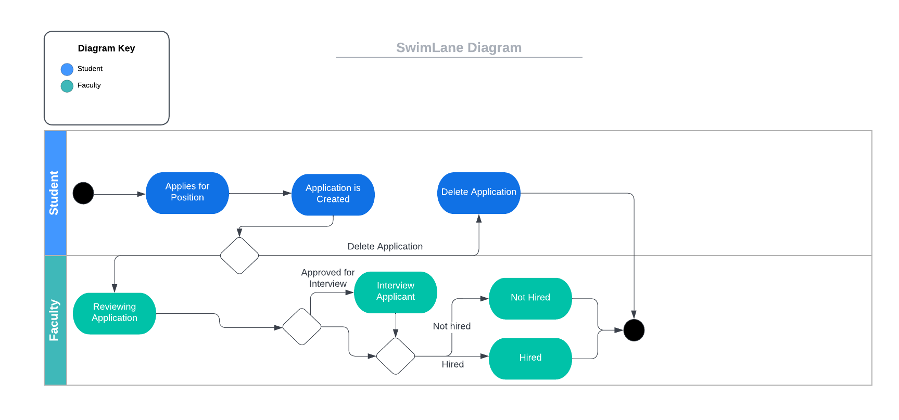
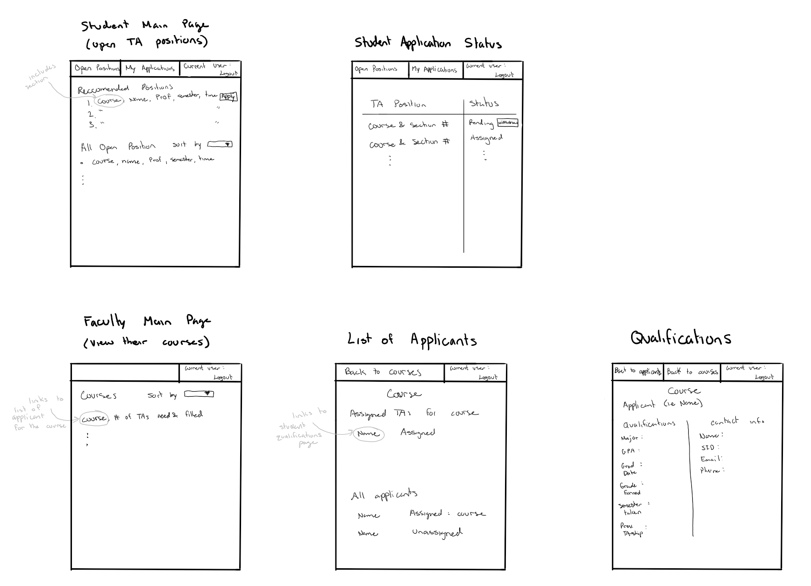

# Software Requirements Specification

## TA Finder -- TeamAlpha
--------
Prepared by:

* `Yeesa Kee`
* `Cai Haught`
* `Ella Blevins`

---

**Course** : CptS 322 - Software Engineering Principles I

**Instructor**: Sakire Arslan Ay

---

## Table of Contents
- [Software Requirements Specification](#software-requirements-specification)
  - [## TA Finder -- TeamAlpha](#-ta-finder----teamalpha)
  - [Table of Contents](#table-of-contents)
  - [Document Revision History](#document-revision-history)
- [1. Introduction](#1-introduction)
  - [1.1 Document Purpose](#11-document-purpose)
  - [1.2 Product Scope](#12-product-scope)
  - [1.3 Document Overview](#13-document-overview)
- [2. Requirements Specification](#2-requirements-specification)
    - [Student](#student)
- [Software Requirements Specification](#software-requirements-specification-1)
  - [## TA Finder -- TeamAlpha](#-ta-finder----teamalpha-1)
  - [Table of Contents](#table-of-contents-1)
  - [Document Revision History](#document-revision-history-1)
- [1. Introduction](#1-introduction-1)
  - [1.1 Document Purpose](#11-document-purpose-1)
  - [1.2 Product Scope](#12-product-scope-1)
  - [1.3 Document Overview](#13-document-overview-1)
- [2. Requirements Specification](#2-requirements-specification-1)
    - [Student](#student-1)
    - [Instructor](#instructor)
  - [2.1 Customer, Users, and Stakeholders](#21-customer-users-and-stakeholders)
    - [Customer](#customer)
    - [Stakeholders](#stakeholders)
    - [Users](#users)
  - [2.2 Use Cases](#22-use-cases)
  - [2.3 Non-Functional Requirements](#23-non-functional-requirements)
- [3. User Interface](#3-user-interface)
- [4. Product Backlog](#4-product-backlog)
- [4. References](#4-references)

## Document Revision History

| Name       | Date       | Changes       | Version |
|------------|------------|---------------|---------|
| Revision 1 | 2022-10-05 | Initial draft | 1.0     |
| Revision 2 | 2022-10-08 | Second Draft  | 2.0     |
|            |            |               |         |

----
# 1. Introduction

Requirements Document that explains the purpose and scope of the TA Finder project.  
It lists the necessary use cases that are implemented.

## 1.1 Document Purpose

The Software Requirement Specification will highlight all the use cases and functionalities that the project will provide.  
It is intended for the developers and maintainers of the project.

## 1.2 Product Scope

This software aims to provide a system which allows students to apply for TA positions at the school of EECS at WSU. While allowing faculty to choose from the list of applicants to TA for their class.  

Students will be allowed to create a student account to apply for specific TA positions.  
Instructors will be allowed to create an instructor account that allows them to create TA positions, see all applicants interested, and choose a student/students and assign them to a specific class.

## 1.3 Document Overview

The rest of the document will include    

**Requirements Specification**: Details all the requirements of the software.  
**User Interface**: Describes the user interface of the software.  
**Product Backlog**: Includes the link to all the seperate use cases that were developed.  
**References**: Any references used for the development of the software.  

----
# 2. Requirements Specification

### Student
1. Create a student account that will include:
   1. Username (WSU email), password, contact information (name, last name, WSU ID, email, phone), and additional information (major, cumulative GPA, expected graduation date, etc.)
   2. Select courses student has served as a TA before.
2. Login using student credentials
3. View open TA positions available
   1. Page that lists all open TA positions.
   2. Page includes a "Recommended TA Positions" section.
      1. The recommendation will be based on prior TA experience and/or student earned an A.
4. Each TA Position will include:
   1. Course title
   2. Semester
   3. Instructor's information
   4. Qualifications required for the position
5. Applying for a Position
   1. Students can apply to multiple TA positions, application includes:
      1. Grade they earned for the course.
      2. Year and semester course was taken.
      3. Year and semester for the application.
6. Application Status
... (224 lines left)
Collapse
message.txt
22 KB

# Software Requirements Specification

## TA Finder -- TeamAlpha
--------
Prepared by:

* `Yeesa Kee`
* `Cai Haught`
* `Ella Blevins`

---

**Course** : CptS 322 - Software Engineering Principles I

**Instructor**: Sakire Arslan Ay

---

## Table of Contents
- [Software Requirements Specification](#software-requirements-specification)
  - [## TA Finder -- TeamAlpha](#-ta-finder----teamalpha)
  - [Table of Contents](#table-of-contents)
  - [Document Revision History](#document-revision-history)
- [1. Introduction](#1-introduction)
  - [1.1 Document Purpose](#11-document-purpose)
  - [1.2 Product Scope](#12-product-scope)
  - [1.3 Document Overview](#13-document-overview)
- [2. Requirements Specification](#2-requirements-specification)
    - [Student](#student)
- [Software Requirements Specification](#software-requirements-specification-1)
  - [## TA Finder -- TeamAlpha](#-ta-finder----teamalpha-1)
  - [Table of Contents](#table-of-contents-1)
  - [Document Revision History](#document-revision-history-1)
- [1. Introduction](#1-introduction-1)
  - [1.1 Document Purpose](#11-document-purpose-1)
  - [1.2 Product Scope](#12-product-scope-1)
  - [1.3 Document Overview](#13-document-overview-1)
- [2. Requirements Specification](#2-requirements-specification-1)
    - [Student](#student-1)
    - [Instructor](#instructor)
  - [2.1 Customer, Users, and Stakeholders](#21-customer-users-and-stakeholders)
    - [Customer](#customer)
    - [Stakeholders](#stakeholders)
    - [Users](#users)
  - [2.2 Use Cases](#22-use-cases)
  - [2.3 Non-Functional Requirements](#23-non-functional-requirements)
- [3. User Interface](#3-user-interface)
- [4. Product Backlog](#4-product-backlog)
- [4. References](#4-references)

## Document Revision History

| Name       | Date       | Changes       | Version |
|------------|------------|---------------|---------|
| Revision 1 | 2022-10-05 | Initial draft | 1.0     |
| Revision 2 | 2022-10-08 | Second Draft  | 2.0     |
|            |            |               |         |

----
# 1. Introduction

Requirements Document that explains the purpose and scope of the TA Finder project.  
It lists the necessary use cases that are implemented.

## 1.1 Document Purpose

The Software Requirement Specification will highlight all the use cases and functionalities that the project will provide.  
It is intended for the developers and maintainers of the project.

## 1.2 Product Scope

This software aims to provide a system which allows students to apply for TA positions at the school of EECS at WSU. While allowing faculty to choose from the list of applicants to TA for their class.  

Students will be allowed to create a student account to apply for specific TA positions.  
Instructors will be allowed to create an instructor account that allows them to create TA positions, see all applicants interested, and choose a student/students and assign them to a specific class.

## 1.3 Document Overview

The rest of the document will include    

**Requirements Specification**: Details all the requirements of the software.  
**User Interface**: Describes the user interface of the software.  
**Product Backlog**: Includes the link to all the seperate use cases that were developed.  
**References**: Any references used for the development of the software.  

----
# 2. Requirements Specification

### Student
1. Create a student account that will include:
   1. Username (WSU email), password, contact information (name, last name, WSU ID, email, phone), and additional information (major, cumulative GPA, expected graduation date, etc.)
   2. Select courses student has served as a TA before.
2. Login using student credentials
3. View open TA positions available
   1. Page that lists all open TA positions.
   2. Page includes a "Recommended TA Positions" section.
      1. The recommendation will be based on prior TA experience and/or student earned an A.
4. Each TA Position will include:
   1. Course title
   2. Semester
   3. Instructor's information
   4. Qualifications required for the position
5. Applying for a Position
   1. Students can apply to multiple TA positions, application includes:
      1. Grade they earned for the course.
      2. Year and semester course was taken.
      3. Year and semester for the application.
6. Application Status
   1. Submitted applications will appear as "Pending".
   2. Accepted applications will appear as "Assigned".
7. Application Withdrawl
   1. Student can withdraw only "Pending" applications.

### Instructor
1. Create a instructor account that will include:
   1. Username (WSU email), password, contact information (name, last name, WSU ID, email, phone).
2. Login using instructor credentials
3. Create TA Positions
   1. Choose among listed courses for TAship.
   2. Specify number of TAs and qualifications needed.
   3. Specify semester of TAship.
   4. Instructors can create TA positions for multiple courses.
4. Page that lists all the students who applied for TAship of one of their courses.
   1. Shows whether student has been assigned to a course.
5. View the qualifications for each student (GPA, grades earned for the class, and past courses served as TA).
6. Assigning students to TA position
   1. Instructor can select a student (that has not been assigned to a course) and assign them to a TA position they created.
   2. Student can only be assigned to one TA position.
   3. A course can have multiple TAs (cannot exceed maximum number of TAs specified).

## 2.1 Customer, Users, and Stakeholders

### Customer
Professor Sakire Arslan Ay

### Stakeholders
Professor Sakire Arslan Ay and Cpts 322 TAs

### Users
Faculty in the school of EECS at WSU and WSU students.

----
## 2.2 Use Cases

Thre are two types of users of this application; students and faculty. Students have the ability to apply for open TA positions and delete pending applications. Faculty can create TA positions and assign applicants (students) to those positions.

| Use case # 1      |   |
| ------------------ |--|
| Name              | Create Student Account  |
| Users             | Student  |
| Rationale         | Students can create an account with their information to apply for TA positions  |
| Triggers          | User selects Student Registration option |
| Preconditions     | Student is on Login page and no user is currently logged in |
| Actions           | 1. Student indicates software should open "Student Registration".    2. The software responds by displaying "Student Registration" page which prompts the user for information.   3. Student fills out user information: username (WSU email), password, contact information (name, last name, WSU ID, email, phone), and additional information (major, cumulative GPA, expected graduation date, etc.).  4. Select courses student has TA'd before   5. User indicates that the system should create the account.   6. System responds by creating student account and redirecting to student main page.|
| Alternative paths | 1. In Step 3, if user inputs invalid information, system will flash a warning and not create account   2. At anytime, if user decides to abort action, system goes back to precondition|
| Postconditions    | Student account is created and stored in the database |
| Acceptance tests  | 1. There are no repeats of student account with same WSU email   2. Student account is created successfully   3. All student information is included in the account.   4. Student can successfully login to their account after registration |
| Iteration         | Iteration #1 |

| Use case # 2      |   |
| ------------------ |--|
| Name              | Create Faculty Account  |
| Users             | Faculty |
| Rationale         | Faculty need to create an account which is specific to faculty |
| Triggers          | User selects "register faculty" option |
| Preconditions     | No user is currently logged in and user is on the login page  |
| Actions           | 1. The Faculty indicates that the software should open the "Faculty Registration"   2. The software responds by displaying "Faculty Registration" page which prompts the user for account information (username, password) and contact information (name, last name, WSU ID, email, phone)   3. Faculty inputs the information and indicates that the software should submit the information and create the account.   4. The software adds a new faculty member to the database.   5. The software re-directs to the main page. |
| Alternative paths | 1. In steps 1, 2, or 3, the user may decide to abort the account creation. In this case, the software returns to the precondition state.   2. In step 3, the user may input invalid information. In this case the software will flash a warning to the user and will not continue to step 4 until the input has been corrected.  |
| Postconditions    | The user is logged-in with their new account and the account has been added to the database. The main page is displayed.  |
| Acceptance tests  | 1. There are no repeats of faculty account with same WSU email   2. Faculty account is created successfully   3. All faculty information is included in the account.   4. Faculty can successfully login to their account after registration  |
| Iteration         | Iteration #1  |

| Use case # 3      |   |
| ------------------ |--|
| Name              | Login  |
| Users             | All users  |
| Rationale         | Users can login to their respective accounts with proper creditials. Students should have student privileges and faculty should have faculty previleges.   |
| Triggers          | The user selects the "Login" option  |
| Preconditions     | The user is not already logged in.  |
| Actions           | 1. The user provides their login information.    2. The system responds by validating credentials.   3. The system directs the user to their account.  |
| Alternative paths | 1. In Step 2 the system may find the that given credentials are not correct in which case the system should return to the precondition state and warn the user that the given information is incorrect.   |
| Postconditions    | The user has been logged in  |
| Acceptance tests  | Can see the correct account upon logging in with proper credentials or the login page when using incorrect credentials  |
| Iteration         | Iteration #1  |

| Use case # 4      |   |
| ------------------ |--|
| Name              | View Open TA Positions |
| Users             | Student |
| Rationale         | Student can go to "TA Positions" page and see all the open TA Positions and view information about them. It will include a list of recommended positions based on user information. |
| Triggers          | Student is logged in |
| Preconditions     | User is logged into a student account |
| Actions           | 1. System displays list of open TA positions, with recommended positions at the top. |
| Alternative paths | 1. The user indicates that they want to go to the main page when not already on it. The system responds by displaying the list of open TA positions. |
| Postconditions    | Student sees "View TA Positions" page displayed |
| Acceptance tests  | "View TA Positions" page displays properly with all the information |
| Iteration         | Iteration #2 |

| Use case # 5      |   |
| ------------------ |--|
| Name              | TA Application  |
| Users             | Student   |
| Rationale         | Student users may want to apply for a TA position. They need an application page where they can enter information about themselves.  |
| Triggers          | User selects "apply for position" option  |
| Preconditions     | User is logged in and viewing a list of open TA positions  |
| Actions           | 1. The user indicates that the software should open an application for the specified TA position.   2. The software responds with opening the application and prompting the user for information.   3. The user inputs the information and indicates that the software should submit the information.  4. The software adds a new application that can be viewed by the course instructor and adds the application to the database.  5. The software re-directs to a page displaying all the applications the user has submitted. |
| Alternative paths | 1. In steps 1, 2, or 3, the user may decide to abort the application. In this case, the software returns to the precondition state.   2. In step 3, the user may input invalid information. In this case the software will flash a warning to the user and will not continue to step 4 until the input has been corrected.  |
| Postconditions    | A new application is added to the database and the user has been re-directed to a application status page  |
| Acceptance tests  | Make sure the application has been added to the database  |
| Iteration         | Iteration #2  |

| Use case # 6      |   |
| ------------------ |--|
| Name              | View Application Statuses  |
| Users             | Students  |
| Rationale         | After a student has submitted an application they may want to view the status of their application.  |
| Triggers          | User selects the "View Application Status" option  |
| Preconditions     | A student user is logged in  |
| Actions           | 1. User requests to view the status of their application.   2. The software responds by displaying all their submitted applications with their statuses. If there are none the page says that no applications have been submitted.  |
| Alternative paths | None  |
| Postconditions    | Can view a page with all submitted applications and their statuses  |
| Acceptance tests  | Displays submitted application statuses  |
| Iteration         | Iteration #3 |

| Use case # 7      |   |
| ------------------ |--|
| Name              | Withdraw Application  |
| Users             | Student |
| Rationale         | Students who want to withdraw their TA application can do so on a withdraw application page. |
| Triggers          | Student selects "Withdraw Application" option |
| Preconditions     | User is logged into a student account, has already submitted an application for the position they want to withdraw from, and are on the application status page |
| Actions           | 1. Selects "Withdraw Application" option   2. The system responds by issuing pop up warning that this action cannot be undone.   3. User indicates they wish to continue.   4. The system responds by deleting the application from the database. |
| Alternative paths | 1. Student aborts action after Step 1,2,3, the system returns to the precondition     |
| Postconditions    | Student's application is withdrawn and deleted from database |
| Acceptance tests  | 1. Student's application is no longer shown on their "Application Status" page   2. Instructor cannot see student's application on the "List of Applicants" page   3. Student's application is deleted from database. |
| Iteration         | Iteration #3 |

| Use case # 8      |   |
| ------------------ |--|
| Name              | Create TA Positions  |
| Users             | Faculty   |
| Rationale         | Faculty users may require TAs for their courses. They will need to create TA positions that the student users can apply for.  |
| Triggers          | User selects "New TA position" option |
| Preconditions     | Faculty user is logged in  |
| Actions           | 1. Faculty indicates that the software is to create a new TA position.   2. The software responds by showing the user a pre-determined list of courses and prompts the user for other necessary information.   3. The user selects a course and enters the other information.   4. The user indicates that the software should submit.   5. The software adds the new TA position to the database and re-directs the user to a list of the TA positions that they have created.  |
| Alternative paths | 1. In steps 1, 2, or 3, the user may decide to abort the creation of a new TA position. In this case, the software returns to the precondition state.   2. In step 3, the user may input invalid information. In this case the software will flash a warning to the user and will not continue to step 5 until the input has been corrected.  |
| Postconditions    | A new TA position has been added to the database, and the user is re-directed to a list of all the TA positions that they have created.  |
| Acceptance tests  | Make sure that the TA position has been added to the database.  |
| Iteration         | Iteration #1  |

| Use case # 9      |   |
| ------------------ |--|
| Name              | View List of Applications  |
| Users             | Faculty  |
| Rationale         | A faculty member may want to see the list of students who have applied for a given TA position and that student's current position.  |
| Triggers          | User selects a course to view applicants for  |
| Preconditions     | User should logged in and on the courses page |
| Actions           | 1. User specifies that they wish to see the applicants for a TA position for a given course   2. The system responds by directing the user to a page which displays the applicants for the TA position for the selected course.  |
| Alternative paths | None  |
| Postconditions    | Page displays the list of applicants for a given course  |
| Acceptance tests  | Applicants for a TA position are listed  |
| Iteration         | Iteration #2  |

| Use case # 10      |   |
| ------------------ |--|
| Name              | See Applicant Qualifications  |
| Users             | Faculty |
| Rationale         | Faculty should be able to see an applicant's information and qualifications. |
| Triggers          | Faculty selects an applicant |
| Preconditions     | Faculty logged in and is on the "List of applicants" page |
| Actions           | 1. Faculty selects an applicant.   2. The system responds by displaying the applicant's qualifications and contact information. |
| Alternative paths | None |
| Postconditions    | Faculty is on the "Qualifications" page for an applicant |
| Acceptance tests  | "Qualifications" page is displaying correctly |
| Iteration         | Iteration #3 |

| Use case # 11      |   |
| ------------------ |--|
| Name              | Assign TA  |
| Users             | Faculty  |
| Rationale         | Users may want to decide which students to have as TAs for their courses.   |
| Triggers          | User selects "Assign" option for an applicant  |
| Preconditions     | User has selected a course to view TA applicants for  |
| Actions           | 1. User indicates they wish to assign a TA to a TA position   2. The system responds by issuing pop up warning that this action cannot be undone.   3. User indicates they wish to continue.   4. The system responds by assigning the applicant to the TA position. |
| Alternative paths | 1. In Step 3, the user may decide to abort the assignment process in which case they system returns to the precondition state  |
| Postconditions    | The applicant has been assigned to the TA position for a course and the database gets updated|
| Acceptance tests  | Displays the student in the "assigned" section for course TAs and the database gets updated |
| Iteration         | Iteration #3  |

“A student applies to a research position; initially its status will appear as “Pending”. The faculty who created that position reviews the application and updates the application status to either “Approved for Interview”, or “Hired”, or “Not hired”. The updated status of the application is displayed on the student view.
The student may delete the pending applications (i.e., whose status is still “Pending”. )”

<kbd></kbd>

----
## 2.3 Non-Functional Requirements

List the non-functional requirements in this section.

You may use the following template for non-functional requirements.

1. Due Dates:  Iteration-1 is due October 21st, iteration-2 is due November 14th, and iteration-3 is due December 7th.
2. Security: The system shall not disclose any personal user information to an unauthorized user.
3. Compatibility: The system shall be compatible with all major browsers.
4. Deliverables: All deliverables will be submitted with the proper iteration.
5. Tests: Tests will meet the acceptance tests outlined in the above use cases.
6. Documentation: The design and requirements documents will be properly updated with each iteration.
7. Demo: By the end of the semester, our team will make a short video available to the whole class which overview the project and discuss the lessons we learned in the development process.

----
# 3. User Interface

<kbd></kbd>

----
# 4. Product Backlog

https://github.com/WSU-CptS322-Fall2022/termproject-teamalpha/issues

----
# 4. References

Cite your references here.

For the papers you cite give the authors, the title of the article, the journal name, journal volume number, date of publication and inclusive page numbers. Giving only the URL for the journal is not appropriate.

For the websites, give the title, author (if applicable) and the website URL.

----
----